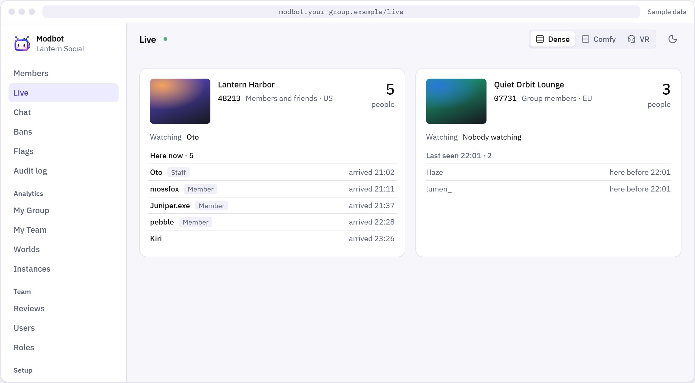
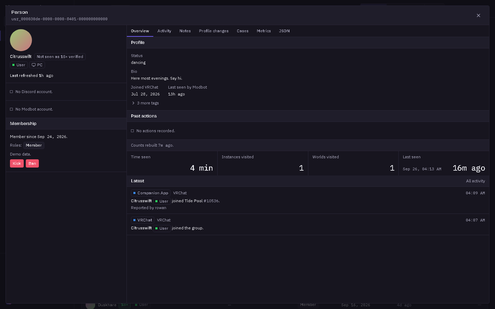
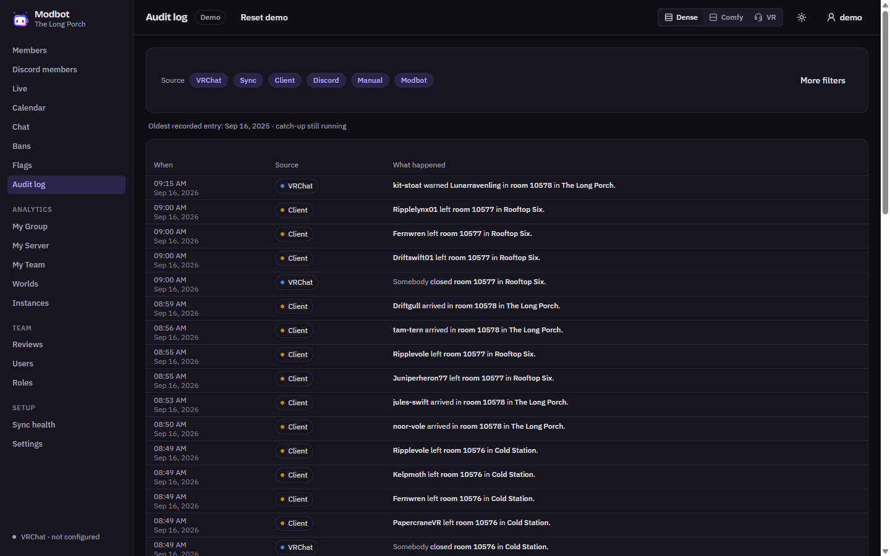
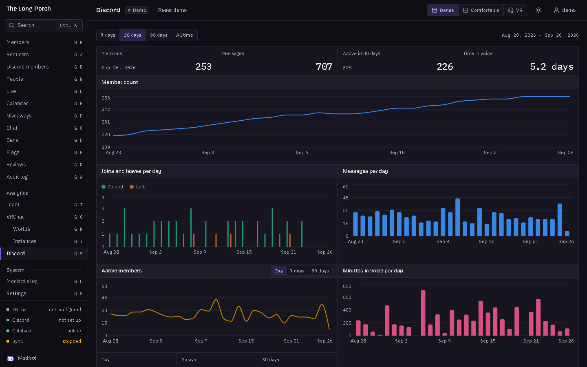
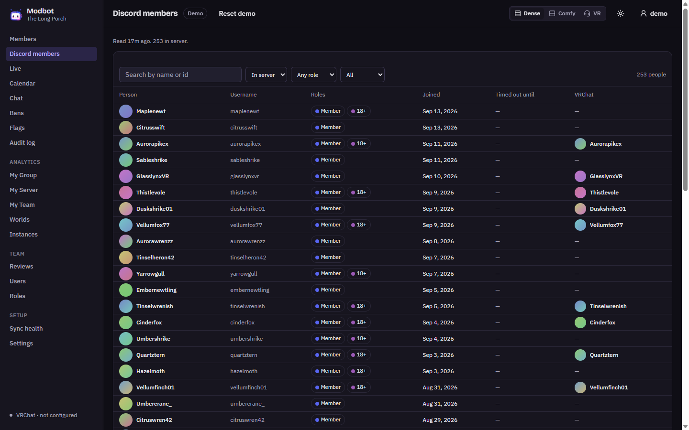

<div align="center">


# Modbot

The open moderation & analytics engine for VRChat & Discord.

Modbot records why each person was banned and who was in the instance at the time. It keeps that
record for as long as you want, in one container and one PostgreSQL database on a server you control.

[](LICENSE)
[](global.json)
[](docker-compose.yml)
[](docs/content/docs/index.mdx)

[](https://railway.com/deploy/modbot)

</div>

---

## What it is

Modbot is moderation, analytics and automation for one VRChat group, and you host it yourself. It
keeps a copy of what VRChat's API tells it about your group, records the history VRChat throws away,
and gives your staff tools VRChat does not have. One Modbot looks after one group.

<div align="center">











<sub>Screenshots from Modbot's own demo mode. The group, the people and the history are made up.</sub>

</div>

## What it does

**Moderation**

- **Live** — every instance your group has open, how full it is, and who arrived last.
- **Members and bans** — searchable and sortable, which VRChat's own lists are not.
- **Case files** — why someone was banned, by whom, written up, with screenshots and clips attached.
- **Audit log** — every event from VRChat next to everything that happened inside Modbot, filterable.
- **Popups** — open a person, a world or an instance on top of the page you are on. They stack, and
  the stack is part of the address, so a link opens the same view.
- **Reviews** — repeat offenders over 30 days, and a second look when a moderator's actions stand out.
- **Calendar** — plan an event once and publish it to VRChat's group calendar, Discord and a calendar
  feed, and open the instance on time.

**Discord**

- A card per open instance, updated as people come and go, with a Join button.
- Bans, kicks, joins, role changes and case files sent to the channels you choose.
- `/lookup` a person and `/recent` actions, with the same permissions as the web app.
- Members link their Discord and VRChat accounts.

**The companion**

- Reports who arrives and leaves your group's instances, read from VRChat's own log.
- A SteamVR overlay that lists the room and warns you when someone with a record walks in.

**Analytics**

- **My Group** — members, joins and leaves, invites, how long people stay.
- **My Team** — actions per moderator, and the gaps when the last moderator left.
- **Worlds and Instances** — where your people spend their time, and your busiest hours.

**AI, if you want it**

- Connect a provider of your choice. Nothing is sent anywhere until you do.
- Chat that looks things up with the asker's own permissions and never takes an action.
- Moderation rules over names and bios, with a moderator reviewing every flag.
- Scheduled insights, a daily call limit, and every call's usage recorded by feature.

**Your team and your own tools**

- Staff sign in as themselves, after proving their VRChat account with a code in their bio.
- Administrator, Moderator and Viewer, or your own roles built from 21 permissions.
- API keys that carry a person's permissions, and every new event over a WebSocket.
- Dense, comfortable or VR layouts, for using the web app from inside a headset.

Work that is designed but not built yet is listed in
[Not built yet](docs/content/docs/not-built-yet.mdx).

## Get started

Modbot is one container and one PostgreSQL database. With Docker, from the repository root:

```bash
cp .env.example .env          # set POSTGRES_PASSWORD and SEQ_ADMIN_PASSWORD
docker compose up -d --build
```

Every release is also published as an image, `ghcr.io/modbot/modbot`, for running it without
the repository. See [Docker](docs/content/docs/self-hosting/docker.mdx).

Open <http://localhost:8080>. The setup wizard opens on first visit and walks you through your
administrator account, a VRChat account, and the group to manage.

On any other host, Modbot needs one environment variable, `DATABASE_URL`. `PORT` is optional and
defaults to 8080. Everything else is set up in your browser and stored in the database — no Redis,
no search server, no message broker, no hosted auth.

Railway, storage buckets, updating, health checks and the rest are in the
[self-hosting guide](docs/content/docs/self-hosting/index.mdx).

## The companion

Each moderator can install a small Windows program that reads VRChat's log while they play and
reports who comes and goes in your group's instances, plus a SteamVR overlay for the same thing in
VR. It pairs with your server through [my.modbot.co](https://my.modbot.co) using a one-time link, and
its token can only report presence and read the room list —
[installing and pairing](docs/content/docs/companion/install.mdx).

## Where things live

| Project | What it is |
|---|---|
| [`src/Modbot.Server`](src/Modbot.Server/README.md) | The server: the API, the web app, the VRChat sync and the Discord bot, in one process |
| [`src/Modbot.Web`](src/Modbot.Web) | The web app your staff open in a browser, served by the server |
| [`src/Modbot.Companion.App`](src/Modbot.Companion.App/README.md) | The Windows companion and its SteamVR overlay |
| [`src/Modbot.Landing`](src/Modbot.Landing/README.md) | `modbot.co`, the landing page |
| [`src/Modbot.My`](src/Modbot.My/README.md) | `my.modbot.co`, where a moderator finds their server and pairs a client |
| [`src/Modbot.Cloud`](src/Modbot.Cloud/README.md) | `cloud.modbot.co`, which keeps the companions' backup |
| [`docs`](docs/README.md) | The documentation site: hosting, setup, usage and the API reference |

<details>
<summary>Everything else in the repository</summary>

| Path | Contents |
|---|---|
| [`.agent/specs/`](.agent/specs/) | Design documents, with the reasoning behind every decision. Read before changing behaviour. |
| [`.agent/plans/`](.agent/plans/) | Implementation plans, task by task |
| [`.agent/research/`](.agent/research/) | Empirical findings about VRChat's API and logs, with fixtures |
| [`tests/`](tests/) | One test project per area, plus shared test support |
| `explore/` | A scratch tool for probing the live VRChat API. Not part of the product. |

</details>

## Contributing

```bash
dotnet build Modbot.slnx
dotnet run --project tests/Modbot.Core.Tests -c Release    # one project per area under tests/
```

The tests are run directly, not with `dotnet test`, and the data tests need Docker — they run against
real PostgreSQL. [`CLAUDE.md`](CLAUDE.md) explains why, along with the naming and writing conventions
this project holds to.

Contributions are covered by [`CLA.md`](CLA.md): you keep your copyright, and the project gets a
licence broad enough to keep its licensing coherent over time.

## Privacy

[`PRIVACY_POLICY.md`](PRIVACY_POLICY.md), also published at
[modbot.co/privacy](https://modbot.co/privacy). It answers two sets of questions: one for people in
a group whose moderators run Modbot, and one for operators running it — what a copy of Modbot
records, what it sends out, and how to stop each of those.

## Licence

[AGPL-3.0](LICENSE). You may use, modify, self-host and fork Modbot. If you run a **modified** Modbot
as a network service, you must offer its source to your users — that clause is the reason for
choosing AGPL over a permissive licence.

The name and logo are not granted by the licence, so please pick your own name if you fork — see
[`TRADEMARK.md`](TRADEMARK.md).

---

<sub>Modbot is not endorsed by or affiliated with VRChat Inc. or Discord Inc. VRChat is a trademark
of VRChat Inc. Discord is a trademark of Discord Inc. SteamVR is a trademark of Valve Corporation.
Windows is a trademark of Microsoft Corporation. Docker is a trademark of Docker, Inc. PostgreSQL is
a trademark of the PostgreSQL Community Association of Canada. Modbot and its logo are trademarks of
the Modbot project.</sub>
